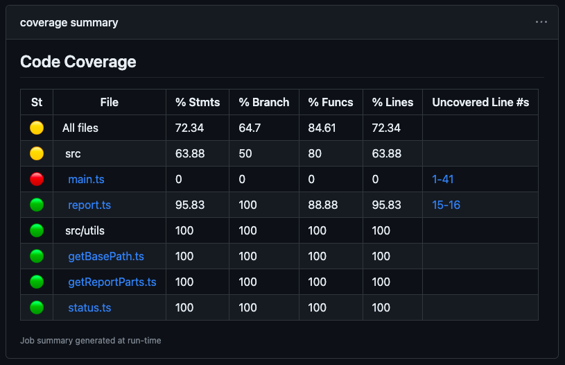

<p align="center">
  <a href="https://github.com/actions/typescript-action/actions"></a>
</p>

# Jest coverage report in markdown

This action uses a text coverage report from jest and generates a markdown report based on it.
The report generates as in the example below. Each file gets a link to the correct version; the same goes for uncovered lines.
Statuses also add to the table.

St|File                | % Stmts | % Branch | % Funcs | % Lines | Uncovered Line #s
--|--------------------|---------|----------|---------|---------|-------------------
🟡|All files           |   70.58 |    72.22 |   83.33 |   71.42 |                   
🟡|&nbsp;src|   63.23 |    64.28 |      80 |   64.17 |                   
🔴|&nbsp;&nbsp;[main.ts](https://github.com/fingerprintjs/action-coverage-report-md/blob/80148ef2d10c51d31e3a472c61ce2ead8b68a2e1/src/main.ts)|       0 |        0 |       0 |       0 |[1-37](https://github.com/fingerprintjs/action-coverage-report-md/blob/80148ef2d10c51d31e3a472c61ce2ead8b68a2e1/src/main.ts#L1-L37)
🟢|&nbsp;&nbsp;[report.ts](https://github.com/fingerprintjs/action-coverage-report-md/blob/80148ef2d10c51d31e3a472c61ce2ead8b68a2e1/src/report.ts)|   95.55 |      100 |   88.88 |   95.55 |[14-15](https://github.com/fingerprintjs/action-coverage-report-md/blob/80148ef2d10c51d31e3a472c61ce2ead8b68a2e1/src/report.ts#L14-L15)
🟢|&nbsp;src/utils|     100 |      100 |     100 |     100 |                   
🟢|&nbsp;&nbsp;[getReportParts.ts](https://github.com/fingerprintjs/action-coverage-report-md/blob/80148ef2d10c51d31e3a472c61ce2ead8b68a2e1/src/utils/getReportParts.ts)|     100 |      100 |     100 |     100 |
🟢|&nbsp;&nbsp;[status.ts](https://github.com/fingerprintjs/action-coverage-report-md/blob/80148ef2d10c51d31e3a472c61ce2ead8b68a2e1/src/utils/status.ts)|     100 |      100 |     100 |     100 |

> **Note**
> This package isn’t part of our core product. It’s kindly shared “as-is” without any guaranteed level of support from Fingerprint. We warmly welcome community contributions.

## Usage

Action returns output `markdownReport` and you can use it in other actions.
Example below shows how to use this report in the comment to pr

```yaml
steps:
  - name: Prepare coverage report in markdown
    uses: fingerprintjs/action-coverage-report-md@v1
    id: coverage
  - name: Add coverage comment to the PR 
    uses: marocchino/sticky-pull-request-comment@v2
    with:
      message: ${{ steps.coverage.outputs.markdownReport }}
```

### Extended usage

```yaml
steps:
  - name: Prepare coverage report in markdown
    uses: fingerprintjs/action-coverage-report-md@v1
    id: coverage
    with:
      textReportPath: './coverage/text-report.txt'
      srcBasePath: './utils'
  - name: Add coverage comment to the PR 
    uses: marocchino/sticky-pull-request-comment@v2
    with:
      message: ${{ steps.coverage.outputs.markdownReport }}
```

#### Add coverage report to the job summary

You can add code coverage report to the job summary. More you can find
in [the official documentation](https://docs.github.com/en/actions/using-workflows/workflow-commands-for-github-actions#adding-a-job-summary).



```yaml
steps:
  - name: Prepare coverage report in markdown
    uses: fingerprintjs/action-coverage-report-md@v1
    id: coverage
    with:
      textReportPath: './coverage/text-report.txt'
      srcBasePath: './utils'
  - name: Add coverage report to the job summary
    run: |
      echo "## Code Coverage" >> $GITHUB_STEP_SUMMARY
      echo "${{ steps.coverage.outputs.markdownReport }}" >> $GITHUB_STEP_SUMMARY
```

## API

### Inputs

`textReportPath` - path to the coverage report in Istanbul text format.
default value is `'./coverage/coverage.txt'`

`srcBasePath` - base path for the source folder
default value is `'./src'`

### Outputs

`markdownReport` - Coverage report in markdown

## How to get text coverage report

### Jest

#### CLI

```shell
npx jest --coverage --coverageReporters="text" > coverage.txt
```

#### Configuration file

```js
module.exports = {
  // ... other settings
  coverageReporters: [['text', { file: 'coverage.txt', path: './' }]],
};
```

### nyc (Istanbul)

#### CLI

```shell
npx nyc report --reporter=text > ./coverage/coverage.txt
```

#### Configuration file

```js
module.exports = {
  // ... other settings
  "reporter": ["text"],
  "report-dir": "./coverage"  // will generate a file ./coverage/text.txt
}
```
### Karma

```js
module.exports = function(config) {
  config.set({
    // ... other settings
    reporters: ['coverage'],
    coverageReporter: {
        type : 'text',
        dir: './coverage',
        file: 'coverage.txt'
    }
  });
};
```
